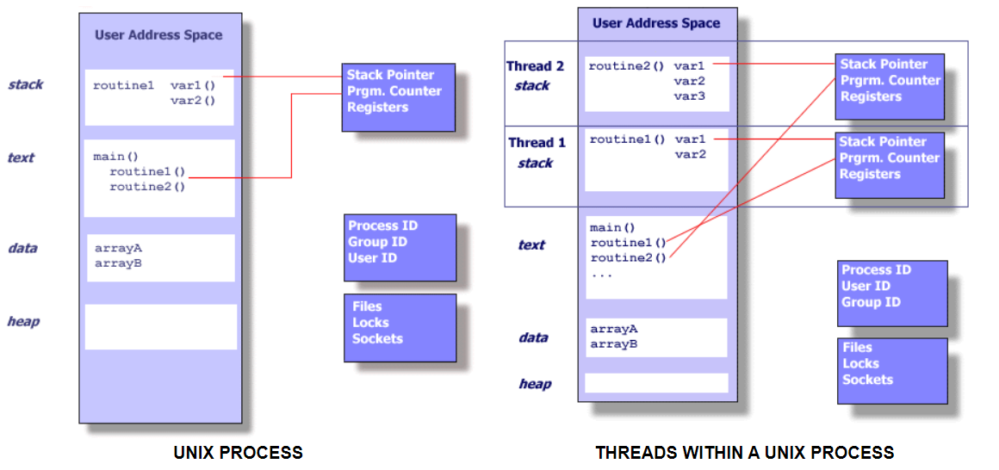

### POSIX Threads Programming

###### 1. Pthreads Overview

- What is thread?

  - A thread is an entity within a process that can be scheduled for execution. 

- Process & Thread

  ```
  			  操作系统：从工厂的角度来理解进程(process)线程(thread)
  
  1、 计算机的核心是CPU，它承担了所有的计算任务。它就像一座工厂，时刻在运行。
  
  2、 假定工厂的电力有限，一次只能供给一个车间使用。也就是说，一个车间开工的时候，其他车间都必须停工。背后的含义就是，单个CPU（一核）一次只能运行一个任务。
  
  3、 进程就好比工厂的车间，它代表CPU所能处理的单个任务。任一时刻，CPU总是运行一个进程，其他进程处于非运行状态。
  
  4、 一个车间里，可以有很多工人。他们协同完成一个任务。
  
  5、 线程就好比车间里的工人。一个进程可以包括多个线程。
  
  6、 车间的空间是工人们共享的，比如许多房间是每个工人都可以进出的。这象征一个进程的内存空间是共享的，每个线程都可以使用这些共享内存。
  
  7、 可是，每间房间的大小不同，有些房间最多只能容纳一个人，比如厕所。里面有人的时候，其他人就不能进去了。这代表一个线程使用某些共享内存时，其他线程必须等它结束，才能使用这一块内存。
  
  8、 一个防止他人进入的简单方法，就是门口加一把锁。先到的人锁上门，后到的人看到上锁，就在门口排队，等锁打开再进去。这就叫”互斥锁”（Mutual exclusion，缩写 Mutex），防止多个线程同时读写某一块内存区域。
  
  9、 还有些房间，可以同时容纳n个人，比如厨房。也就是说，如果人数大于n，多出来的人只能在外面等着。这好比某些内存区域，只能供给固定数目的线程使用。
  
  10、 这时的解决方法，就是在门口挂n把钥匙。进去的人就取一把钥匙，出来时再把钥匙挂回原处。后到的人发现钥匙架空了，就知道必须在门口排队等着了。这种做法叫做”信号量”（Semaphore），用来保证多个线程不会互相冲突。
  
  不难看出，”互斥锁”（mutex）是”信号量”（semaphore）的一种特殊情况（n=1时）。也就是说，完全可以用后者替代前者。但是，因为mutex较为简单，且效率高，所以在必须保证资源独占的情况下，还是采用这种设计。
  
  11、 操作系统的设计，因此可以归结为三点：
  （1）以多进程形式，允许多个任务同时运行；
  （2）以多线程形式，允许单个任务分成不同的部分运行；
  （3）提供协调机制，一方面防止进程之间和线程之间产生冲突，另一方面允许进程之间和线程之间共享资源。
  ————————————————
  版权声明：本文为CSDN博主「王晓(Java)」的原创文章，遵循 CC 4.0 BY-SA 版权协议，转载请附上原文出处链接及本声明。
  原文链接：https://blog.csdn.net/qq_29229567/article/details/93974374
  ```
  
- A process is created by the operating system, and requires a fair amount of "**overhead**". Processes contain information about program resources and program execution state, including:

  - Process ID, process group ID, user ID, and group ID

  - Environment

  - Working directory.

  - Program instructions

  - Registers

  - Stack

  - Heap

  - File descriptors

  - Signal actions

  - Shared libraries

  - Inter-process communication tools (such as message queues, pipes, semaphores, or shared memory)

    

-  In the UNIX environment, a thread:

  - Exists within a process and uses the process resources
  - Has its own independent flow of control as long as its parent process exists and the OS supports it
  - Duplicates only the essential resources it needs to be independently schedulable
  - May share the process resources with other threads that act equally independently (and dependently)
  - Dies if the parent process dies - or something similar
  - Is "lightweight" because most of the overhead has already been accomplished through the creation of its process.

- What is Pthreads?

  - A set of C language programming types and procedure calls.

- Why Pthreads?

  - When compared to the cost of creating and managing a process, a thread can be created with much **less operating system overhead**. Managing threads requires fewer system resources than managing processes.

- When Pthreads?

  - Work that can be executed, or data that can be operated on, by multiple tasks simultaneously:
  - Block for potentially long I/O waits
  - Use many CPU cycles in some places but not others
  - Must respond to asynchronous events
  - Some work is more important than other work (priority interrupts)

###### 2. Designing Threaded Programs

- Parallel Programming
  - Common Models for threaded programs exist:
    - Worker
      - A single thread, the *manager* assigns work to other threads, the *workers*. Typically, the manager handles all input and parcels out work to the other tasks. 
      - Static worker pool + dynamic worker pool
    - Pipeline
      -  a task is broken into a series of sub-operations, each of which is handled in series, but concurrently, by a different thread. 
    - Peer 
      - similar to the manager/worker model, but after the main thread creates other threads, it participates in the work.
- Shared Memory Model
  - All threads have access to the same global, shared memory
  - Threads also have their own private data
  - Programmers are responsible for synchronizing access (protecting) globally shared data

###### 2. The Pthreads API

###### 3. Compiling Threaded Programs

###### 4. Thread Management 

- Creating and Termination Threads
- Passing Arguments to Threads
- Joining and Detaching Threads
- Stack Management
- Miscellaneous Routines

###### 5. Mutex Variables

###### 6. Condition Variables

###### 7. Monitoring, Debugging and Performance Analysis Tools for Pthreads


### Clock_gettime

```c
int clock_gettime(clockid_t clk_id, struct timespec *tp);
```

- Retrieve the time of the specified clock `clk_id`

  - The `clk_id` argument is the identifier of the particular clock on which to act. A clock may be system-wide and hence visible for all processes, or per-process if it measures time only within a single process.

    - real-time clock - `CLOCK_REALTIME`
      - Its time represents seconds and nanoseconds since the Epoch.  When its time is changed, timers for a relative interval are unaffected, but timers for an absolute point in time are affected.
    - `CLOCK_MONOTONIC`
      - Not affected by discontinous jumps in the system time (e.g., if the system administrator manually changes the clock), but is affected by the incremental adjustments performed by `adjtime(3)` and NTP.
      - This clock does not count time that the system is suspended.

  - [Which clock to use?]: https://www.cs.rutgers.edu/~pxk/416/notes/c-tutorials/gettime.html

    - For getting the system's idea of the time of day (in seconds since the Epoch), one should use `clock_gettime(CLOCK_REALTIME, &tp)`.
    - For measuring elapsed time, CLOCK_MONOTONIC is recommended. This clock will not necessarily reflect the time of day but, unlike CLOCK_REALTIME, it is guaranteed to always be linearly increasing (although not necessarily between reboots). 

- `tp` argument is *timespec* structures, as specified in *<time.h>*

  ```c
  struct timespec {
      time_t   tv_sec;        /* seconds */
      long     tv_nsec;       /* nanoseconds */
  };
  ```

  